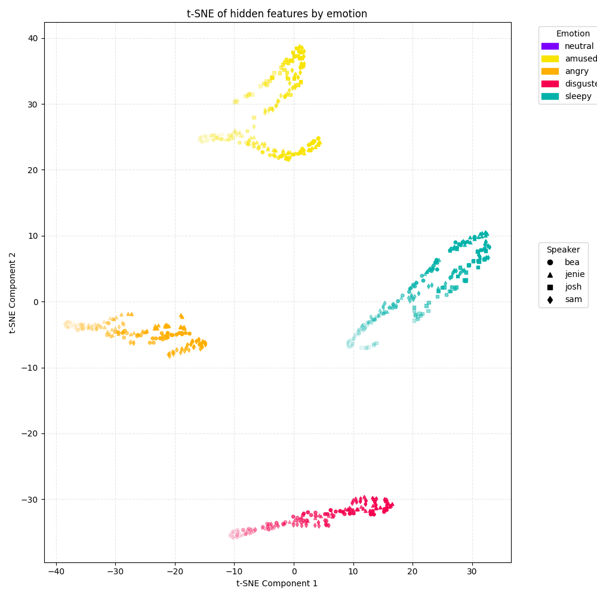

<div align="center">

<h1>Fine-grained Emotional Control of Text-to-Speech</h1>
<h3>Learning to Rank Inter- and Intra-Class Emotion Intensities</h3>
<h4><i>Shijun Wang, Jón Guðnason, Damian Borth</i></h4>
<h4>ICASSP 2023</h4>

</div>

<br>

Fine-grained emotional control for Text-to-Speech enables generation of speech with varying emotional intensities. This repository implements a ranking model that learns inter- and intra-class emotion strength and a FastSpeech2 based TTS system conditioned on those intensities. Preprocessing converts raw audio to features, aligns transcripts using Montreal Forced Aligner (MFA) and splits data for training. The EmoV-DB dataset is used, containing multiple speakers with several emotions each. Example scripts are provided for preparing data, training models and performing inference.

<br>

---

<div align="center">

⚠️ This is an **unofficial implementation** of the paper.  
For the original work, please refer to the [ICASSP 2023 paper](https://ieeexplore.ieee.org/document/10097118).

</div>

---

<br>

## Environment
- Docker image: `pytorch/pytorch:2.2.0-cuda11.8-cudnn8-devel`
- GPU: NVIDIA RTX 4060 (8GB VRAM)

<br>

## Setup
1. Clone this repository and install Python requirements:
   ```bash
   pip install -r requirements.txt
   ```
2. Download the [EmoV-DB dataset](https://www.openslr.org/115/) and place it under `/workspace/data/EmoV-DB` (path can be changed in `parameter.yaml`).
3. Download the pretrained HiFi-GAN vocoder for LibriTTS (16kHz) to `/workspace/pretrained_models/tts-hifigan-libritts-16kHz`.

<br>

## Preprocessing
1. **Prepare MFA corpus**
   ```bash
   python rank_model/prepare_mfa.py
   ```
2. **Install Montreal Forced Aligner**

    ```
   # Create and activate environment
    conda create -n aligner -c conda-forge montreal-forced-aligner -y
    conda activate aligner

    # Download models and dictionary
    mfa model download acoustic english_us_arpa
    wget -O /workspace/montreal_forced_aligner/librispeech-lexicon.txt \
        https://openslr.org/resources/11/librispeech-lexicon.txt

    # Validate and align
    mfa validate /workspace/montreal_forced_aligner/corpus \
                /workspace/montreal_forced_aligner/librispeech-lexicon.txt english_us_arpa

    mfa align /workspace/montreal_forced_aligner/corpus \
            /workspace/montreal_forced_aligner/librispeech-lexicon.txt english_us_arpa \
            /workspace/montreal_forced_aligner/aligned

    # Return to base environment
    conda activate base
    ```

3. **Feature extraction**
   ```bash
   python rank_model/preprocess.py
   ```
4. **Prepare FastSpeech2 dataset splits**
   ```bash
   python fastspeech2/preprocess.py
   ```
<br>

## Training
Train the rank model and FastSpeech2 model sequentially:
```bash
PYTHONENV=. python rank_model/train.py
PYTHONENV=. python fastspeech2/train.py
```

<br>

## Inference
Generate speech using the trained models:
```bash
PYTHONENV=. python rank_model/inference.py
PYTHONENV=. python fastspeech2/inference.py
```

<br>

## Results

### 1. T-SNE Visualization of Intensity Representation

This plot visualizes the learned intensity representations extracted by the RankModel using T-SNE.
Each point corresponds to a sentence-level representation, color-coded by emotion labels (e.g., Angry, Neutral, Amused, etc.).

<div align="center">

</div>

From the plot, we observe that emotional utterances are well-separated in the latent space, indicating that the intensity extractor effectively captures emotion-specific characteristics. Notably, *neutral* and *sleepiness* samples form distinct clusters, supporting the model’s ability to generalize emotion intensity.


### 2. Predicted Mel-Spectrograms of FastSpeech2 (Epoch 20, Batch Size 8)

Below is a comparison between predicted and ground-truth mel-spectrograms for randomly sampled utterances at epoch 20.


- Top 8: **Predicted Mel-Spectrograms**  
- Bottom 8: **Ground Truth Mel-Spectrograms**

We observe that the model captures the overall prosody and spectral shape well. However, subtle mismatches in pitch contour and energy levels still exist, especially in high-emotion utterances. Improvements are expected with additional fine-tuning or by incorporating emotion intensity explicitly.


<br>

## Reference

Wang, S., Guðnason, J., & Borth, D. (2023, June). Fine-grained emotional control of text-to-speech: Learning to rank inter-and intra-class emotion intensities. In ICASSP 2023-2023 IEEE International Conference on Acoustics, Speech and Signal Processing (ICASSP) (pp. 1-5). IEEE.

<br>

## Acknowledgements

- [Montreal Forced Aligner (MFA)](https://montreal-forced-aligner.readthedocs.io/)
- [HiFi-GAN Vocoder](https://github.com/jik876/hifi-gan)